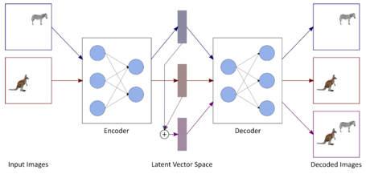
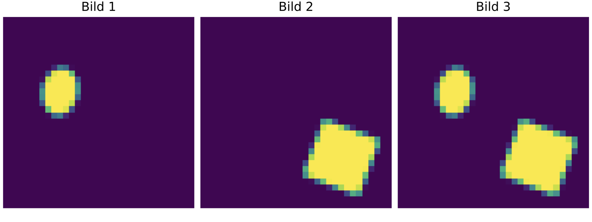
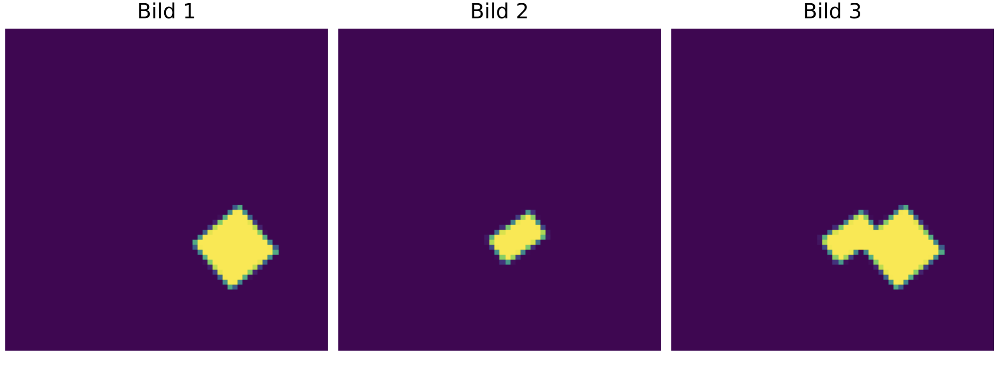
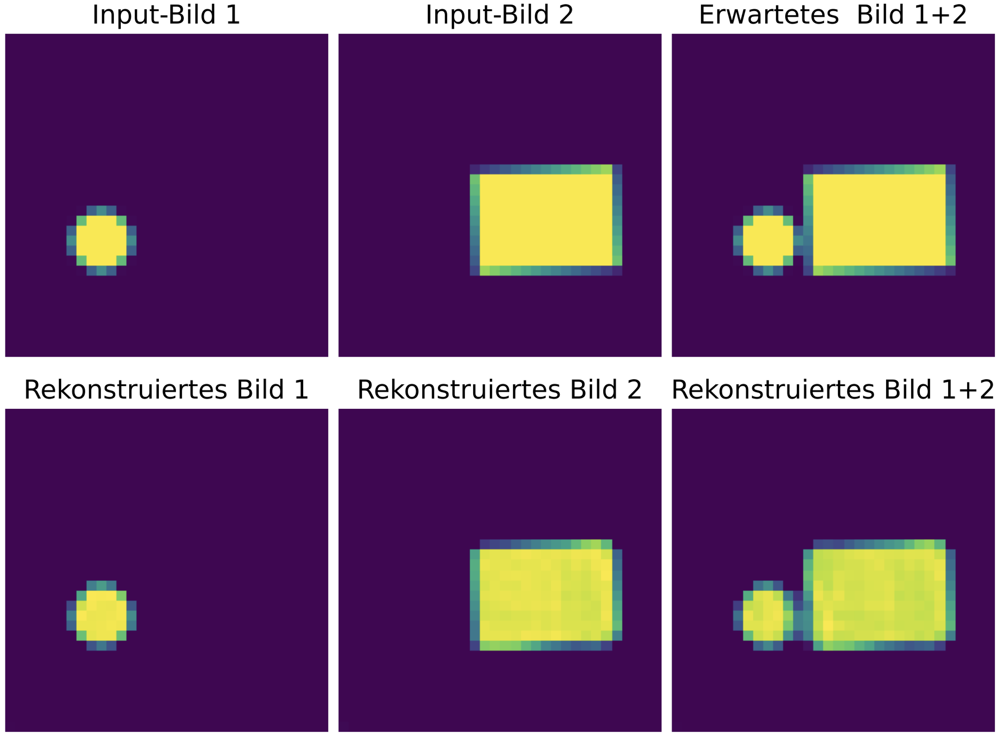
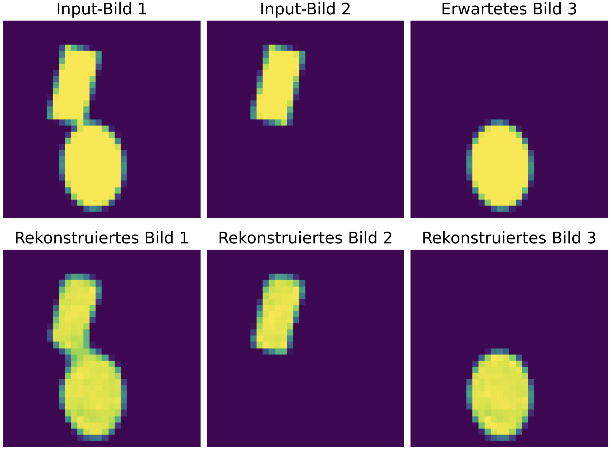

# Arithmetik-feur-Bildinhalte-mit-Neuronale-Netzen

## Motivation and goal:

Autoencoders are specialized neural networks in which input data, such as images for instance, are initially compressed in the encoder part and then decompressed back to their original form in the decoder part. In between, in the so-called bottleneck, vectors are created that describe the input signal; however, only the decoder can interpret them meaningfully. As shown above, we neither have access to their generation nor their evaluation, which is why we refer to them as latent vectors.

In this work, we aim to perform calculations with these latent vectors. Refer to the above illustration for this purpose.
When we add them, the input images are intended to be combined. In other words, all objects from both images should appear in the resulting image.
Such a scheme, for instance, is useful in the field of path planning for autonomously operating robots, as individual disruptive elements in the environment could be iteratively addressed and virtually removed from the detected image.

## Training Dataset:
Sample with an image size of 32x32 pixels:

Sample with an image size of 64x64 pixels:

## Experiment result:
Result of the Addition Model:

Result of the Subtraction Model: 

