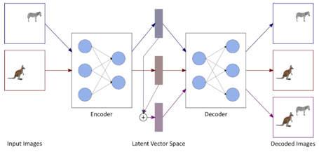

# Arithmetik-feur-Bildinhalte-mit-Neuronale-Netzen

## Motivation und Ziel:

Autoencoder sind spezielle Neuronale Netze, in denen Eingangsdaten wie zum Beispiel Bilder zunächst im Encoder-Teil komprimiert und dann im Decoder-Teil wieder zu den Ursprungsdaten dekomprimiert werden. Dazwischen, im sogenannten Flaschenhals, entstehen Vektoren, die das Eingangssignal beschreiben, allerdings kann sie nur der Decoder sinnvoll interpretieren.
Wie oben dargestellt haben wir weder Zugriff auf ihre Entstehung noch ihre Auswertung und nennen sie deshalb latente Vektoren.

In dieser Arbeit wollen wir versuchen, mit diesen latenten Vektoren zu rechnen. Siehe dazu obige Abbildung.
Wenn wir sie addieren, dann sollen dadurch die Eingangsbilder kombiniert werden. Anders gesagt, alle Objekte aus beiden Bildern sollen im Ergebnisbild auftauchen.
Ein solches Schema ist zum Beispiel im Bereich der Bahnplanung autonom agierender Roboter von Nutzen, da einzelne Störelemente in der Umgebung iterativ behandelt und virtuell aus dem detektierten Bild entfernt werden könnten.